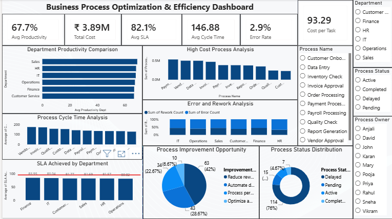

# Business Process Optimization & Efficiency Dashboard

## 📌 Project Objective
To design an interactive Power BI dashboard that identifies process bottlenecks, inefficiencies, and redundant workflows – enabling data-driven operational improvements, cost reduction, and enhanced productivity.

## 📊 Business Problem
Organizations often struggle with slow processes, high costs, frequent errors, and missed SLA targets. Without a centralized view, it's difficult to pinpoint where to focus improvement efforts. This dashboard provides a complete performance overview across departments, processes, and KPIs.

## 📁 Dataset Description
- **Source:** Generated realistic dataset (150 process records)
- **Rows:** 150
- **Columns:** Process ID, Process Name, Department, Process Owner, Cycle Time, Standard Cycle Time, Task Volume, Tasks Completed, Productivity %, Error Count, Rework Count, Process Cost, Customer Complaints, SLA Target, SLA Achieved, Process Status, Improvement Opportunity, etc.

## 🛠️ Tools Used
- Power BI Desktop (DAX, Power Query)
- GitHub (Portfolio hosting)

## 📈 KPI Framework (Key Metrics)
| KPI | Value |
|-----|-------|
| Average Productivity | 67.7% |
| Average SLA Achievement | 82.1% |
| Average Cycle Time | 146.9 hours |
| Error Rate | 2.9% |

## 📊 Dashboard Features
- **KPI Cards** – Productivity, SLA, Cycle Time, Error Rate, Cost
- **Department Productivity Comparison** – Bar chart
- **Process Cycle Time Analysis** – Bottleneck identification
- **High Cost Process Analysis** – Cost optimization focus
- **Process Status Distribution** – Active / Completed / Delayed
- **Improvement Opportunity Analysis** – Categorization of issues
- **Slicers** – Department, Process Status, Process Owner
- **Insights & Recommendations Page** – Actionable business insights

## 🔍 Key Insights
- Vendor Approval has the highest cycle time, indicating a major process bottleneck.
- Payment Processing is the highest-cost process and requires cost optimization initiatives.
- Operations department records the highest errors and rework, impacting process quality.
- 76% of processes are delayed, resulting in SLA performance of 82.1% against the 95% target.
- Reduce Rework is the most common improvement opportunity, affecting 42% of processes.
- Operations department has 82.14% delayed processes, higher than the organizational average.
- Payment Processing shows below-average productivity (66.5%) despite being the most expensive process.

## ✅ Recommendations
- Automate Vendor Approval workflows to reduce cycle time and improve process efficiency.
- Optimize Payment Processing through workflow automation and reduced manual intervention.
- Implement quality control checks and employee training in the Operations department.
- Introduce process monitoring and SLA tracking mechanisms to reduce delays.
- Focus on rework reduction through process standardization and validation controls.
- Review Finance and Payment-related workflows to improve productivity and cost efficiency.
- Establish continuous improvement initiatives using KPI-based performance monitoring.

## 📈 Expected Business Impact
- Reduced process cycle time
- Improved SLA compliance
- Lower operational costs
- Reduced errors and rework
- Increased employee productivity
- Enhanced customer satisfaction

## 📸 Dashboard Screenshots

## 📁 Files in Repository
- `Dataset/business_process_optimization_dataset_150_rows.csv`
- `PowerBI/Business Process OPtimization Dashboard.pbix`
- `Screenshots/`

## 🚀 How to Use
1. Download the `.pbix` file.
2. Open with Power BI Desktop.
3. Use slicers to filter by department, status, or process owner.
4. Explore bottleneck charts and recommendations.

## 📬 Connect with Me
[https://www.linkedin.com/in/naziya-shamim]
